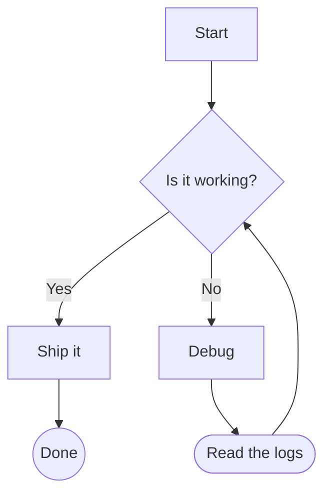
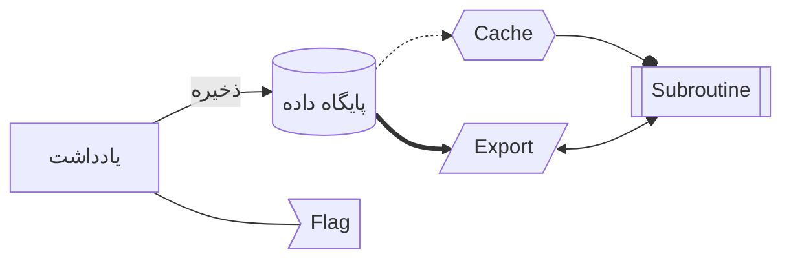
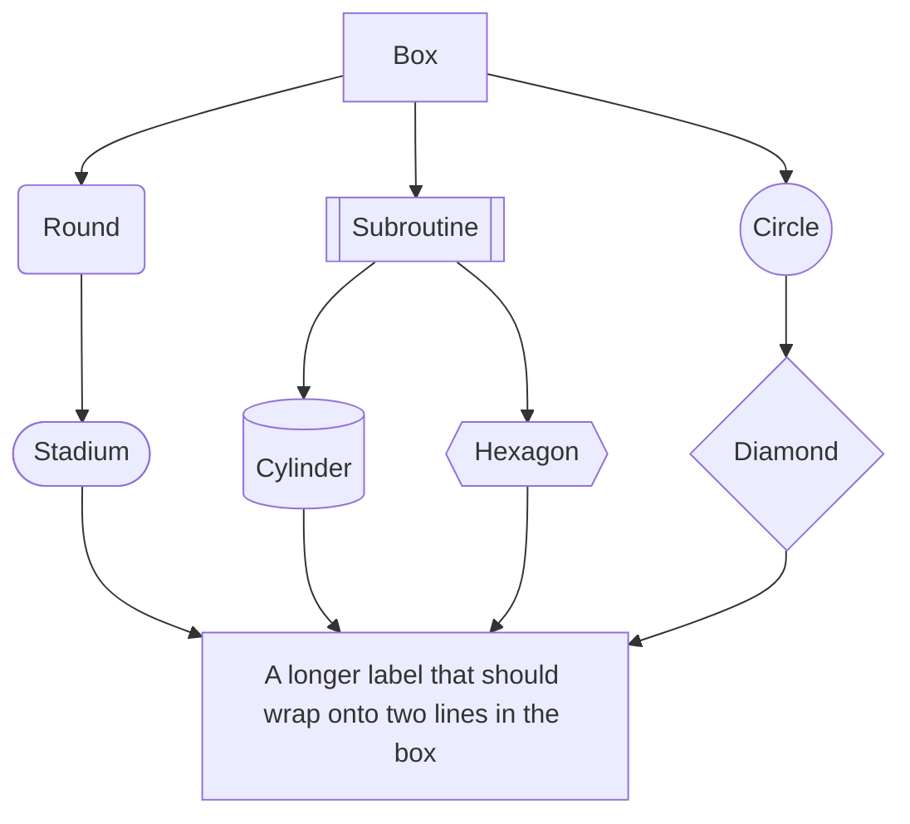
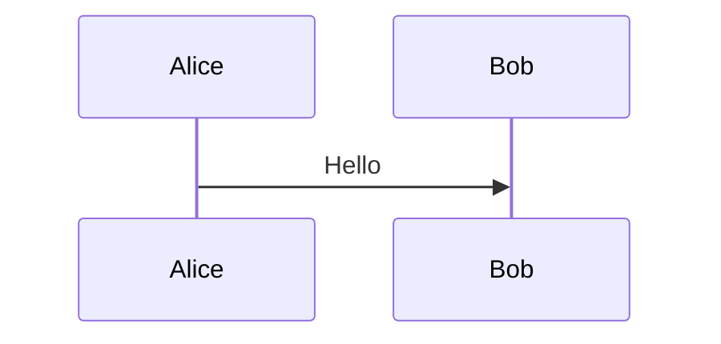

# Diagrams

A decision with a loop back:

```mermaid
flowchart TD
    A[Start] --> B{Is it working?}
    B -- Yes --> C[Ship it]
    B -- No --> D[Debug]
    D --> E([Read the logs])
    E --> B
    C --> F((Done))
```

Left to right, with Persian labels and every kind of line:

```mermaid
graph LR
    a[یادداشت] -->|ذخیره| b[(پایگاه داده)]
    b -.-> c{{Cache}}
    b ==> d[/Export/]
    a --- e>Flag]
    c --o f[[Subroutine]]
    d <--> f
```

Shapes:

```mermaid
flowchart TD
    s1[Box] --> s2(Round) --> s3([Stadium])
    s1 --> s4[[Subroutine]] --> s5[(Cylinder)]
    s1 --> s6((Circle)) --> s7{Diamond}
    s4 --> s8{{Hexagon}}
    s3 & s5 & s7 & s8 --> s9[A longer label that should wrap onto two lines in the box]
```

Not a flowchart, so it stays code:

```mermaid
sequenceDiagram
    Alice->>Bob: Hello
```
